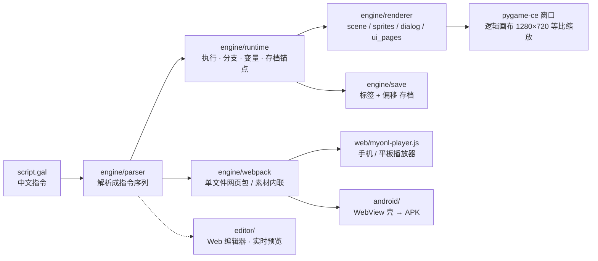

# MYONL · 手机游戏制作器

**简体中文** | [English](README.en.md)

[](https://github.com/123456789556/myonl/actions/workflows/tests.yml)


**装在安卓手机上，就能自己做视觉小说。** 写台词、放图、放音乐，点一下导出，
出来的文件发给谁都能打开玩。

| 手机上玩成品 | 游戏菜单 |
|:---:|:---:|
|  |  |

## 装它

**[⬇ 下载 MYONL-v1.2.0.apk](https://github.com/123456789556/myonl/releases/download/v1.2.0/MYONL-v1.2.0.apk)** · 安卓 7.0 以上 · 手机平板同一个包

装好打开就是书架，点「新建作品」开始。点底部「导出」得到一个自包含 `.html`，
发微信、发 QQ、传电脑，对方浏览器打开就能玩。

## 三步出东西

1. **写** —— 点作品进去，中间那栏写台词，一行一句。`@` 开头的是指令（`@bg 教室` 换背景、`@music 名字` 放歌）。
2. **放素材** —— 底部「素材」，把图 / 音乐选进素材库；手机上点一下就能选，也能从相册「分享」进来。
3. **导出** —— 底部「导出」，得到一个 `.html`，发给谁都能打开玩。

## 不用担心的三件事

- **不联网** —— 全程离线，作品和素材都不上传。
- **存档不会丢** —— 换新版只换安装包，作品和素材留在原地（固定签名，覆盖安装不清数据）。
- **横屏竖屏都能玩** —— 横过来、竖着，画面都跟着重排。

## 版本怎么算

装最新那个就行，**存档不会丢**，不用比版本号。

| 号 | 什么时候动 |
|---|---|
| `v1.0.0` → `v1.1.0` | 多出一件你能做的事 |
| `v1.1.0` → `v1.1.1` | 修掉影响使用的问题，或界面明显变了 |
| 不动号 | 重构、补测试、像素微调 —— 只提交，攒着跟下次一起发 |

每次发版都在 [docs/CHANGELOG.md](docs/CHANGELOG.md) 写清楚「你能感觉到什么变了」，
不写内部流水账。细则见 [docs/版本规则.md](docs/版本规则.md)。

---

# 给想深究的人

只想做游戏的话，上面那些就够了。下面是技术细节。

> 全量测试：**1393 passed, 3 skipped**（2026-11-19 本机亲手复跑，Windows，退出码 0，139.85s）。
> 这个数是带日期的实测值；下一版会变，届时一并更新。

## 手机端能做什么、做不到什么

**能编、能存、能放图放音乐、能自己出成品。**

- 剧本由 `engine/parser.js` 解析，和电脑端 `engine/parser.py` **逐字段一致**（`tools/pack_diff.py`
  拿 `games/` 下工程对拍）；成品由 `engine/pack.js` 拼成单文件 HTML，手机上点一下就能导出。
- **素材**：图片进来就压到最长边 1280；音频原样存；存在设备本机（图片在 `IndexedDB`，剧本在 `localStorage`）。
- **一个真实上限**：单文件 HTML 把素材内联成 base64（体积再涨约三分之一），40 MB 起提醒风险，
  80 MB 是硬线，低端机大概率白屏。更大的素材要走「文件夹 / zip 发行」，还没做。

APK 的 `minSdk` 是 24（安卓 7.0），一个包同时装手机和安卓平板。
**APK 里装的是编辑器**：打开就是「我的作品」，能新建、能写剧本、能放素材、能存本机、能把成品导出带走。

手机端解析器未实现 `@voice` `@anim` `@fg` `@cg` `@camera` `@transition` `@plug` `@include`，
写到这些行会明确报错并指出第几行；完整边界见 [docs/手机端编游戏.md](docs/手机端编游戏.md)。

## 其它拿法

| 你要什么 | 拿哪个 |
| :--- | :--- |
| 任何浏览器打开，不装东西 | 自己导出的单文件 HTML（编辑器底部「导出」一点就有） |
| 编辑器单文件（`file://` 双击就能编，带离线内核） | `py -3 tools/build_editor_single.py` → `dist/web/editor-single.html` |
| **发行包**（Windows 双击即玩，玩家的机器上不用装 Python） | 仓库内 `py -3 tools/build_release_zip.py` 自建；包里只放成品和使用说明，不带源码指令 |

> 不做 iOS。网页包在 iOS 浏览器里能打开，但没有 iOS 安装包。

## 示例工程（都是自己造的，不是别人的作品）

`games/` 里四个，打开就能改：

- **教程示例**（14 个文件）—— 指令怎么用，一句一句都标好了
- **标准示例**（24 个文件）—— 一个完整工程长什么样：剧本、素材、配置齐全
- **新游戏模板**（21 个文件）—— 从空的开始，删干净只剩骨架
- **newbie_demo**（7 个文件）—— 内置进 APK 的试玩示例

素材全是自己造的占位图，随便改、随便删，不用惦记版权。
拿别人的游戏当样板属于再分发，不进这个仓库。

## 剧本长什么样

```gal
@bg bg_天台
@music bgm_night

@label start
@show 林晚 微笑
@[林晚] 你又迟到了两分钟。      # 方括号 = 角色台词（不登记也能用）
@ 晚风把她的发梢吹起。          # @ + 空格 = 旁白
@choice:
  > 一起看日落 -> 结局_看日落
  > 说出那个约定 -> 结局_约定

@label 结局_看日落
@[[林晚]] 那年夏天，风很长。    # 双括号 = 整屏独白（NVL）
@end
```

存档记的是「离哪个标签往后数几句」，不是行号，所以剧本小改、加新章节，旧存档依然能读。
指令全集与参数见 [docs/engine_spec.md](docs/engine_spec.md)。

## 它是怎么跑起来的


```mermaid
flowchart LR
  A["script.gal<br/>中文指令"] --> B["engine/parser<br/>解析成指令序列"]
  B --> C["engine/runtime<br/>执行 · 分支 · 变量 · 存档锚点"]
  C --> D["engine/renderer<br/>scene / sprites / dialog / ui_pages"]
  D --> E["pygame-ce 窗口<br/>逻辑画布 1280×720 等比缩放"]
  C --> F["engine/save<br/>标签 + 偏移 存档"]
  B --> G["engine/webpack<br/>单文件网页包 / 素材内联"]
  G --> H["web/myonl-player.js<br/>手机 / 平板播放器"]
  G --> I["android/<br/>WebView 壳 → APK"]
  B -.-> J["editor/<br/>Web 编辑器 · 实时预览"]
```

同一套 `parser → runtime → 素材清单` 既供玩家窗口，也供编辑器右侧预览和网页包：预览就是引擎的真实渲染，不是另画的示意图。

## 源码开发（Windows，需 Python 3.9+）

```powershell
pip install -r requirements.txt

# 1) 跑自带示例
py -3 -m engine.demo games/标准示例/script.gal --assets games/标准示例

# 2) 新建一个自己的游戏
py -3 -m engine.cli new 我的第一个游戏

# 3) 打开 Web 编辑器（浏览器 http://127.0.0.1:8000）
py -3 -m engine.editor --project games/我的第一个游戏

# 4) 打包成玩家双击即玩的目录（dist/<游戏名>/）
py -3 pack.py games/我的第一个游戏

# 5) 出单文件网页包（手机/平板用这个）
py -3 -c "from engine.webpack import build_single; build_single(r'games\我的第一个游戏', r'dist\web\游戏.html', title='游戏')"
```

### 测试与门禁

```powershell
py -3 -m pytest -q -m "not slow"      # 日常快跑
py -3 -m pytest -q                    # 全量（含 slow；通过数以最新 CHANGELOG 为准）
py -3 -m pytest -q -m slow            # 真实打包 / 全渲染 / 性能用例
```

- 测试分层：`unit` / `ui` / `integration` / `slow`；覆盖率门禁 80%（`tools/check_coverage.ps1`）
- 类型检查棘轮：`tools/check_types.ps1`（只拦新增，不偿还存量）
- 改代码的环境、门禁与提交约定见 [docs/贡献指南.md](docs/贡献指南.md)；模块结构见 [docs/架构说明.md](docs/架构说明.md)

## 目录

| 目录 | 内容 |
|---|---|
| `engine/` | 引擎核心：解析、运行时、渲染、存档、编辑器后端、网页包/打包 |
| `web/` | 手机 / 平板播放器与布局契约测试 |
| `android/` | APK 工程（WebView 壳 + 固定签名 + Gradle 配置） |
| `editor/` | Web 编辑器前端（HTML/CSS/JS，无构建） |
| `games/` | 示例工程（全是自造素材） |
| `tests/` | pytest 无头测试套件（unit / ui / integration / slow） |
| `tools/` | 门禁与工具脚本（coverage / pyright / 打包验证 / 素材导入等） |
| `docs/` | 上手 / 产品说明 / 引擎规格 / 存档与升级 / 开发者与打包指南 |

## 文档

- [快速上手](docs/快速上手.md) · [手机端编游戏](docs/手机端编游戏.md)
- [引擎规格（指令全集）](docs/engine_spec.md) · [素材导入指南](docs/素材导入指南.md)
- [打包使用指南](docs/打包使用指南.md) · [存档与升级](docs/存档与升级.md)
- [架构说明](docs/架构说明.md) · [贡献指南](docs/贡献指南.md) · [插件开发指南](docs/插件开发指南.md)
- [产品说明书](docs/产品说明书.md) · [版本规则](docs/版本规则.md) · [变更记录](docs/CHANGELOG.md)

## 常见问题

- **要会编程吗？** 不用。剧本是有限几条中文指令；只有当你想改引擎本身时才需要读 Python。
- **要联网吗？** 不用。写、预览、打包、游玩全程离线，APK 也不联网。
- **支持 Mac / Linux 吗？** 编辑器与打包器这版只在 Windows 跑；**玩家侧不限** —— 网页包任何现代浏览器都能开，APK 是安卓 7.0 以上。
- **平板要单独打包吗？** 不用。一个 APK 同时装手机和安卓平板，横竖屏按屏幕重排；素材也只有一份。
- **能做 3D / 联机吗？** 不做。这版只做视觉小说。
- **改剧本会让旧存档失效吗？** 不会。存档锚点是「标签 + 偏移」，不是行号。
- **升级会不会冲掉存档？** 不会。APK 用固定签名，覆盖安装；存档在应用自己的存储里，导出/导入也留了后路。
- **打包出来多大？** APK 是壳 + 播放器；单文件网页包**看素材**——素材全内联进 base64 会再涨约三分之一，素材越多越大，这是这条路线的真实上限，不是 bug。
- **内置 AI 吗？** 没有。引擎对外提供 JSON 控制原语，可被外部脚本 / AI 调用，但产品本身不含模型。
- **示例素材能商用吗？** 先读 `NOTICE`；第三方素材各自有条款，不要直接搬。

## English

MYONL is an **offline, MIT-licensed visual-novel (galgame) engine and authoring tool**. You write a
plain-text `.gal` script; the engine handles parsing, presentation (typewriter, camera, transitions,
animated sprites, video backgrounds, voice), branching, save/load, a CG gallery, and packaging.

**Player side targets phones and Android tablets**: one project exports to a single-file HTML bundle
that fills the screen in both orientations, or to an Android APK (minSdk 24) built by GitHub Actions.
A Windows desktop build (double-click, no Python on the player's machine) ships in parallel.

- Editor / packager from source: Python 3.9+ + `pygame-ce` (Windows only).
- Tests: `pytest -q` → full suite headless, all green (exact count in the latest CHANGELOG).
- Documentation is written in Chinese: [快速上手](docs/快速上手.md) · [engine spec](docs/engine_spec.md).

## 许可

MIT（见 [LICENSE](LICENSE)）。第三方组件与素材许可见 [NOTICE](NOTICE)。

> 本产品完全离线运行，不依赖任何在线服务。
